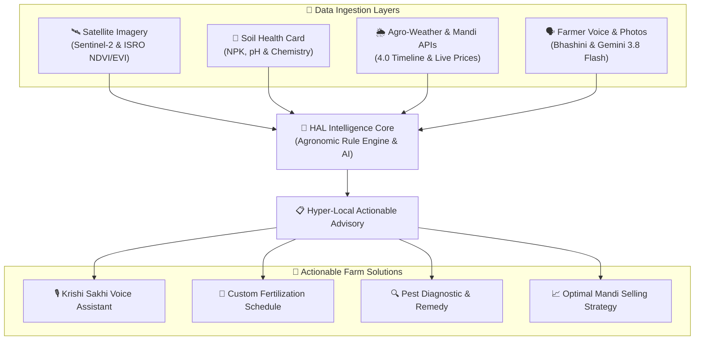
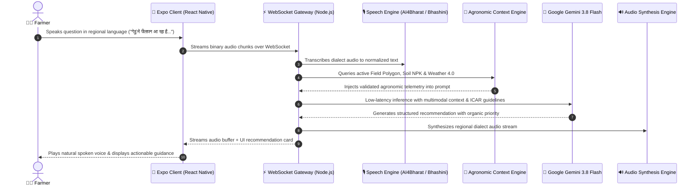

<div align="center">


# HAL / हल
### Harvest Advisory with Linguistic Intelligence
**Autonomous Multimodal Agritech System Grounding Space (Sentinel-2 Satellites), Soil (Chemical SHC OCR), and Speech (Gemini 3.8 Flash & Regional Indian Dialects) for 11.8 Crore Farmers**

[](https://opensource.org/licenses/MIT)
[]()
[-339933.svg?logo=nodedotjs&logoColor=white)]()
[]()
[]()
[]()
[]()
[](#-author--connect)

<br/>

**[📱 App Showcase](#-interactive-mobile-showcase)** •
**[🎯 Problem & Impact](#-the-challenge--quantified-impact)** •
**[🏗️ Architecture & Dataflow](#-system-architecture--real-time-dataflow)** •
**[⚡ 3-Minute Quickstart](#-quickstart--local-development)** •
**[📡 API Reference](#-rest--websocket-api-contracts)** •
**[💡 Engineering Decisions](#-engineering-highlights--tradeoffs)** •
**[👨‍💻 Author Connect](#-author--connect)**

</div>

---

## 📌 Executive Summary

Over **11.8 crore small and marginal farmers (86% of India's agricultural community)** feed the nation, yet most still depend on guesswork, traditional intuition, or local shopkeeper advice. This information asymmetry leads to unbalanced chemical fertilizer usage, preventable crop disease losses, and continuous debt cycles. Just one incorrect fertilizer decision can cost a smallholder farmer over **₹15,000+** in a single season.

**HAL (Harvest Advisory with Linguistic Intelligence)** bridges the digital, linguistic, and scientific divide. By unifying **Space (Sentinel-2 & ISRO Satellite Imagery)**, **Soil (Automated Soil Health Card OCR & Chemistry)**, and **Speech (Voice-First GenAI via Google Gemini 3.8 Flash & AI4Bharat)**, HAL turns every mobile device into an intelligent, hyper-local farming companion.

> *"Space + Soil + Speech = HAL. Farmers talk naturally in their mother tongue, HAL listens, and frontier space science reaches the field."*

---

## 🎯 The Challenge & Quantified Impact

### Comparative Advantage Matrix

| Critical Dimension | Traditional Agriculture | Generic AgTech Apps | **HAL Intelligent System** |
| :--- | :--- | :--- | :--- |
| **Spatial Precision** | Generalized district averages | Static pin-drop weather | **10-meter Sentinel-2 field polygon tracking** |
| **User Interaction** | Complex English forms / Dropdowns | Limited translation | **Zero-typing voice assistant in 8+ Indian dialects** |
| **Soil Integration** | Lost paper Soil Health Cards | Manual data entry | **Computer Vision OCR auto-extraction of NPK & pH** |
| **Advisory Grounding** | Generic manufacturer labels | Static lookup tables | **Multi-modal grounding (Soil + Satellite + Weather 4.0)** |
| **Market Intelligence**| Local middlemen (Arhtiyas) | Stale district mandi rates | **APMC live price discovery + optimal sell date predictor** |

### Measurable Agronomic Outcomes

```
┌──────────────────────────┬──────────────────────────┬──────────────────────────┬──────────────────────────┐
│     📈 Yield Boost       │   💰 Input Cost Savings  │   🌿 Runoff Reduction    │   👥 Scalability Target  │
│        +20% to +30%      │        15% to 20%        │           ~30%           │       1 Crore+ Farmers   │
│  Data-backed sowing &    │  Eliminates unnecessary  │  Shields groundwater     │  Lightweight serverless  │
│  fertilizer scheduling   │  chemical fertilizer spend│  and soil microbiome    │  and offline-first client│
└──────────────────────────┴──────────────────────────┴──────────────────────────┴──────────────────────────┘
```

---

## 📱 Interactive Mobile Showcase

<div align="center">
<table>
  <tr>
    <td align="center" width="33%">
      <br/>
      <b>1. Welcome & Onboarding</b><br/>
      <i>Zero-friction farmer setup</i>
    </td>
    <td align="center" width="33%">
      <br/>
      <b>2. Multilingual Selection</b><br/>
      <i>8+ Indian Regional Dialects</i>
    </td>
    <td align="center" width="33%">
      <br/>
      <b>3. Command Dashboard</b><br/>
      <i>Real-time NDVI, weather & alerts</i>
    </td>
  </tr>
  <tr>
    <td align="center" width="33%">
      <br/>
      <b>4. Krishi Sakhi (Voice AI)</b><br/>
      <i>Gemini 3.8 Flash live audio Q&A</i>
    </td>
    <td align="center" width="33%">
      <br/>
      <b>5. Stage-Wise Advisory</b><br/>
      <i>ICAR-compliant fertilizer calendar</i>
    </td>
    <td align="center" width="33%">
      <br/>
      <b>6. Mandi Price Intelligence</b><br/>
      <i>Live APMC trends & optimal sell date</i>
    </td>
  </tr>
</table>
</div>

---

## 🏗️ System Architecture & Real-Time Dataflow

HAL operates on a decoupled, asynchronous micro-architecture designed for high-concurrency mobile clients and intermittent rural connectivity.

### 1. High-Level Data Ingestion & Solution Architecture



### 2. Real-Time Krishi Sakhi Voice Assistant Sequence



### 3. End-to-End Methodology & Processing Pipeline

<div align="center">
  
</div>

1. **Spatial Ingestion**: Automated ingestion of Copernicus Sentinel-2 L2A optical imagery, OpenWeather One Call 4.0 timelines, and Data.gov.in Mandi prices.
2. **Preprocessing & Atmospheric Correction**: Cloud-mask filtering, coordinate clipping, and 10-meter spatial resampling.
3. **Vegetation Index Calculation**: Computes surface NDVI, Enhanced Vegetation Index (EVI), and Land Surface Temperature (LST).
4. **Soil Health Card OCR Extraction**: Extracts Nitrogen (N), Phosphorus (P), Potassium (K), Organic Carbon (OC), and pH via Vision OCR.
5. **AI Rule Engine & ICAR Calibration**: Validates AI generation against Indian Council of Agricultural Research guidelines with organic-first remediation.
6. **Delivery & Feedback Loop**: Audio/visual delivery via mobile app with field-outcome feedback used to fine-tune recommendation models.

---

## 🌍 Satellite Analytics & Ground Truth Stacking

<div align="center">
  
  <p><i>(a) Pan-India study area across diverse agro-climatic zones, (b) High-resolution ground truth imagery, and (c) Vegetation index stacking (NDVI / EVI) derived from Sentinel-2 multispectral bands.</i></p>
</div>

- **Sentinel-2 Multispectral Imagery**: Real-time 10-meter resolution tracking using Band 4 (Red: 665nm) and Band 8 (Near-Infrared: 842nm).
- **Normalized Difference Vegetation Index (NDVI)**:
  $$\text{NDVI} = \frac{\text{NIR} - \text{Red}}{\text{NIR} + \text{Red}}$$
  Detects crop stress, canopy nitrogen deficiency, and drought onset days before visible to the naked eye.
- **Land Surface Temperature (LST) & Soil Moisture**: Detects drought onset and irrigation requirements before permanent wilting point.

---

## 🛠️ Technology Stack & Engineering Rationale

<div align="center">
  
</div>

| Layer | Technologies Selected | Architectural Rationale & Why It Matters |
| :--- | :--- | :--- |
| **Mobile Client** | **React Native (Expo SDK 57)**, Expo Router, React 19 | Cross-platform (iOS/Android) from a single codebase, fast native audio recording, instant OTA updates, zero app store lag for critical bug fixes. |
| **Backend API** | **Node.js 22**, Express.js (ESM), WebSockets (`ws`) | Event-driven non-blocking I/O ideal for streaming audio chunks and high-concurrency requests from thousands of simultaneous farmers. |
| **AI & Vision** | **Google Gemini 3.8 Flash**, Cloud Vision OCR, Hugging Face | Sub-second latency for voice conversation, multimodal vision reasoning for leaf disease photos, and cost-effective high-token throughput. |
| **Remote Sensing** | **Copernicus Sentinel-2**, ISRO Bhuvan, Sentinel Hub | Free, open-access 10-meter multispectral satellite imagery with 5-day revisit cycle covering all agricultural districts in India. |
| **Real-Time Data** | **OpenWeatherMap One Call 4.0**, Data.gov.in APMC API | Minute-by-minute precipitation timelines for optimal spraying windows; live modal prices across 3,000+ mandis. |
| **Database & Auth** | **Firebase Firestore (NoSQL)**, Firebase Auth | Offline-first local persistence, flexible schema for multi-crop parameters, and zero-latency real-time document synchronization. |
| **Media Storage** | **Cloudinary CDN** | Automatic image compression, WebP transformation, and low-bandwidth delivery for leaf diagnosis in 2G/3G connectivity areas. |

---

## ⚡ Quickstart & Local Development

Follow these steps to run the complete HAL stack on your local machine in under 3 minutes.

### 1. Prerequisites
- **Node.js**: v18 or higher (tested on Node v22 LTS)
- **npm**: v9 or higher
- **Expo Go App**: (Optional) Installed on your mobile phone ([iOS App Store](https://apps.apple.com/app/expo-go/id982107779) / [Android Play Store](https://play.google.com/store/apps/details?id=host.exp.exponent))

### 2. Clone the Repository
```bash
git clone https://github.com/abeerrai01/HAL-Harvest-Advisory-with-Linguistic-Intelligence.git
cd HAL-Harvest-Advisory-with-Linguistic-Intelligence
```

### 3. Backend Setup
```bash
# 1. Navigate to backend directory
cd backend

# 2. Install dependencies
npm install

# 3. Configure environment variables (pre-configured template provided)
cp .env.example .env

# 4. Start the API server
npm start
```
> The backend server boots on **`http://localhost:5050`**.
> Verify it is running by checking the health endpoint:
> ```bash
> curl http://localhost:5050/health
> # Response: {"status":"ok","service":"hal-api"}
> ```

### 4. Frontend Setup
```bash
# 1. Open a new terminal and navigate to frontend directory
cd frontend

# 2. Install dependencies
npm install

# 3. Start Expo development server
npx expo start -c
```
- **Web Browser**: Press `w` in your terminal to instantly run the app in Google Chrome / Edge.
- **Physical Phone**: Scan the displayed terminal QR code using **Expo Go** (Android) or the native Camera app (iOS).

---

## ⚙️ Environment Configuration

The backend is pre-configured with resilient fallbacks and mock data, meaning **the app runs immediately out of the box** even before you add third-party production keys.

Key variables in [`backend/.env.example`](backend/.env.example):

| Variable | Purpose | Default / Example | Required |
| :--- | :--- | :--- | :---: |
| `PORT` | Local server port | `5050` | Yes |
| `GEMINI_MODEL` | Primary LLM model | `gemini-3.8-flash` | Yes |
| `GEMINI_API_KEY` | Google Gemini API key | `AIzaSy...` | Optional (mock fallback available) |
| `WEATHER_API_PROVIDER` | Weather data source | `openweathermap` | Yes |
| `WEATHER_API_KEY` | OpenWeather 4.0 key | `e331f89e59...` | Optional |
| `WEATHER_API_URL` | OpenWeather base URL | `https://api.openweathermap.org/data/4.0` | Yes |
| `SATELLITE_API_PROVIDER` | Satellite data provider | `sentinel_hub` | Optional |
| `CLOUDINARY_*` | Leaf & card image CDN | `cloud_name, api_key, api_secret` | Optional |

---

## 📡 REST & WebSocket API Contracts

HAL provides a clean, well-structured API surface:

### Core Endpoints

| Method | Endpoint | Description | Input Format | Output Format |
| :--- | :--- | :--- | :--- | :--- |
| `GET` | `/health` | Server heartbeat & readiness check | None | `JSON` |
| `POST` | `/api/v1/pest-disease/classify` | AI diagnosis of crop leaf photo | `multipart/form-data` (image) | `JSON (disease, confidence, remedy)` |
| `POST` | `/api/v1/disease-chat` | Multi-turn conversational pest advice | `JSON (message, history, crop)` | `JSON (reply, organic_options)` |
| `POST` | `/api/v1/soil-health-card/extract` | OCR parsing of Soil Health Card | `multipart/form-data` (pdf/jpg) | `JSON (NPK, pH, micronutrients)` |
| `POST` | `/api/v1/soil-advisory` | ICAR-aligned fertilizer calculator | `JSON (crop, field_size, soil_params)`| `JSON (schedule, dosage, cost)` |
| `GET` | `/api/v1/market-prices` | Live APMC Mandi commodity rates | `Query: commodity, state, district` | `JSON (best_today, last10_prices)` |
| `GET` | `/api/v1/market-prices/predict` | Optimal harvest selling date | `Query: commodity, mandi` | `JSON (optimal_date, expected_price)` |
| `POST` | `/api/v1/weather-advisory` | Agro-meteorological timeline | `JSON (lat, lon, crop_stage)` | `JSON (spray_windows, alerts)` |
| `WS` | `/api/farmer-assistant` | Live bidirectional audio stream | `Binary Audio Stream (PCM/WAV)` | `Binary Audio + Markdown Card` |

### Sample Contract: Crop Disease Diagnosis
```json
// POST /api/v1/pest-disease/classify
// Response:
{
  "success": true,
  "crop": "Wheat",
  "diagnosis": "Yellow Rust (Puccinia striiformis)",
  "confidence": 0.964,
  "severity": "Moderate",
  "treatment": {
    "organic": "Spray 5% neem seed kernel extract (NSKE) or bio-fungicide Trichoderma viride.",
    "chemical": "Propiconazole 25% EC @ 1ml per liter of water as immediate containment.",
    "prevention": "Ensure field drainage and avoid excessive nitrogen application."
  }
}
```

---

## 💡 Engineering Highlights & Tradeoffs

During development, several non-trivial architectural decisions were implemented to address real-world edge cases in Indian agriculture:

### 1. Multi-Tier AI Model Cascade
API rate limits, transient network drops, or deprecated model identifiers can cause system failure. HAL implements an automatic multi-tier fallback mechanism:
```javascript
// Primary: Gemini 3.8 Flash (fastest, lowest latency)
// Cascade: gemini-2.5-flash -> gemini-2.0-flash -> gemini-1.5-flash
const response = await callGeminiGenerateContent(apiKey, payload);
```
If the primary model returns a `404` or `400 (invalid model)`, the caller seamlessly falls back to the next tier without throwing an unhandled exception to the mobile user.

### 2. Progressive Query Relaxation for Mandi Data
Indian agricultural market data from `Data.gov.in` is often sparse—a specific village APMC may not have recorded arrivals on a national holiday or weekend. HAL's price engine uses a 4-stage progressive relaxation algorithm:
1. Exact Match: `State + District + Mandi + Commodity`
2. District Match: `State + District + Commodity` (across all local markets)
3. State Match: `State + Commodity`
4. National Fallback: Commodity-wide historical modal pricing with date-decay weighting.

### 3. Asynchronous Worker for Satellite Processing
Calculating 10-meter multispectral vegetative rasters across multi-hectare farm boundaries is compute-intensive. To prevent event-loop blocking in Express, requests create a job ticket (`POST /api/v1/jobs`), delegating raster operations to a dedicated worker pool (`worker.js`) while the client polls or listens via WebSockets.

### 4. Low-Bandwidth Rural Optimization
- Mobile UI assets are compressed and cached locally via AsyncStorage.
- Voice streaming uses compact chunked audio buffers over WebSockets instead of heavy HTTP payload roundtrips.
- Offline mode allows farmers to review previously downloaded fertilizer schedules even in zero-reception fields.

---

## 📁 Repository Structure

```text
HAL-Harvest-Advisory-with-Linguistic-Intelligence/
├── backend/                             # Node.js API server & background job worker
│   ├── src/
│   │   ├── server.js                    # Express server, WebSocket engine & Gemini AI integration
│   │   └── worker.js                    # Asynchronous satellite NDVI & geospatial processing
│   ├── .env.example                     # Environment template with sensible defaults
│   └── package.json                     # Backend dependencies (Express, Firebase Admin, WS, Axios)
├── frontend/                            # React Native / Expo Mobile Application
│   ├── app/                             # Expo file-based navigation layouts
│   ├── assets/                          # Crop illustrations, icons, and agricultural artwork
│   ├── components/                      # Modular UI components (Cards, Charts, Dialect Picker)
│   ├── screens/                         # Feature screens (Dashboard, DiseaseChat, MarketPrices, SoilHealth)
│   ├── services/                        # API client, WebSocket stream, Google translate & i18n
│   ├── app.json                         # Expo application manifest (SDK 57)
│   └── package.json                     # Frontend dependencies (Expo, React 19, Lucide, Reanimated)
├── docs/                                # Project documentation & reference assets
│   ├── HAL_Project_Presentation.pptx    # Executive Project Presentation Slide Deck
│   ├── HAL_Project_Summary.pdf          # Full Technical Architecture & Specification Document
│   └── assets/                          # High-resolution architectural diagrams & UI screenshots
├── .gitignore                           # Comprehensive shield for credentials, keys, and build outputs
└── README.md                            # Primary documentation & engineering showcase
```

---

## 📚 Project Documents & Research Citations

### Reference Materials
- 📊 **Presentation Deck**: [HAL_Project_Presentation.pptx](docs/HAL_Project_Presentation.pptx)
- 📄 **Architecture & System Specification**: [HAL_Project_Summary.pdf](docs/HAL_Project_Summary.pdf)

### Academic & Agronomic Citations
1. L. Klerkx, *"Advisory services and transformation, plurality and disruption of agriculture and food systems: towards a new research agenda for agricultural education and extension studies,"* The Journal of Agricultural Education and Extension, vol. 26, no. 2, pp. 131–140, 2020.
2. K. G. Liakos et al., *"Machine Learning in Agriculture: A Review,"* Sensors, vol. 18, no. 8, Art. no. 8, 2018.
3. Indian Council of Agricultural Research (ICAR), *"Soil Health Management and Fertilizer Recommendation Schedules,"* Ministry of Agriculture & Farmers Welfare, New Delhi.
4. Sentinel-2 User Handbook, European Space Agency (ESA) & Copernicus Open Access Hub.

---

## 👨‍💻 Author & Connect

### **Abeer Rai**
*Full-Stack Engineer • Mobile App Developer • AI Systems Enthusiast*

[](https://linkedin.com/in/theabeerrai)
[](https://github.com/abeerrai01)
[](mailto:theabeerrai@gmail.com)

- 💼 **LinkedIn**: [linkedin.com/in/theabeerrai](https://linkedin.com/in/theabeerrai)
- 🐙 **GitHub**: [@abeerrai01](https://github.com/abeerrai01)
- 📧 **Direct Inquiries**: [theabeerrai@gmail.com](mailto:theabeerrai@gmail.com)
- 🚀 **Placement Objective**: Open for Software Engineering, Full-Stack Developer, and AI/ML Engineering roles.

---

<div align="center">
  <b>Built with ❤️ for Indian Agriculture and Smallholder Farmers</b><br/>
  <i>If you find this project impactful, consider giving it a ⭐ on GitHub!</i>
</div>
