<div align="center">

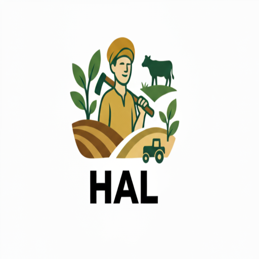

# HAL / हल
### Harvest Advisory with Linguistic Intelligence
**From Soil to Solutions: An AI-Powered, Multilingual Smart Crop Advisory System for Small & Marginal Farmers**

[]()
[]()
[]()
[]()

</div>

---

## 📌 Executive Summary

Over **11.8 crore small and marginal farmers (86% of India's agricultural community)** feed the nation, yet most still depend on guesswork, traditional intuition, or local shopkeeper advice. This dependency leads to unbalanced fertilizer use, preventable crop disease losses, and continuous debt cycles. Just one incorrect fertilizer decision can cost a farmer over **₹15,000+** in a single season.

**HAL (Harvest Advisory with Linguistic Intelligence)** bridges the digital, linguistic, and scientific divide. By unifying **Satellites (Sentinel-2 / MODIS)**, **Government APIs (Soil Health Card, Mandi Prices)**, and **Multilingual Generative AI (Google Gemini 3.8 Flash & AI4Bharat)**, HAL turns every mobile phone into an intelligent, voice-first farming companion.

> *"Space + Soil + Speech = HAL. Farmers talk, HAL listens, and science reaches the field."*

---

## 🛰️ Innovation Edge: "Space + Soil + Speech"

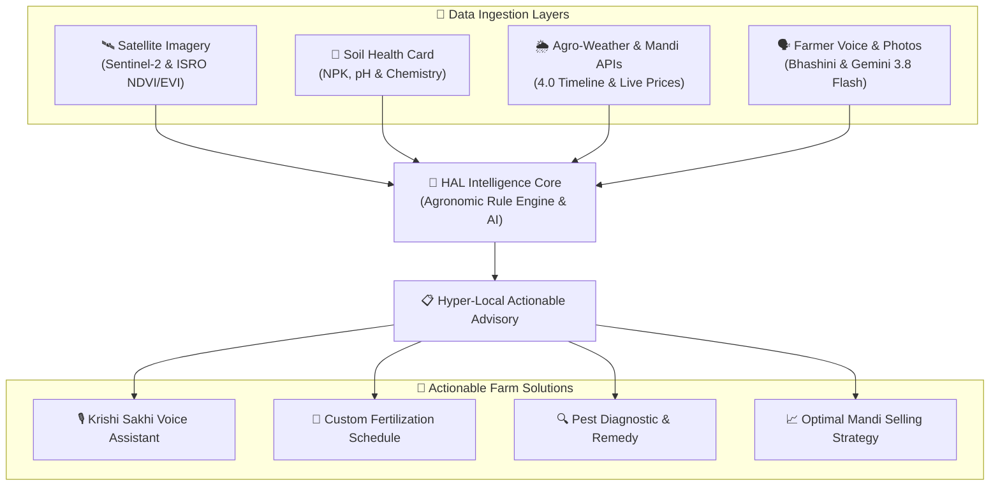

- **Hyper-Local Precision**: Field-level predictions using 4-point polygon satellite coordinate tracking, not generalized district averages.
- **Multilingual Voice-First Interface**: Farmers speak naturally in their native languages (Hindi, Punjabi, Telugu, Tamil, Marathi, Bengali, English) and receive spoken advice.
- **Unified Agritech Engine**: Combines soil chemistry, satellite vegetative indices (NDVI/EVI), weather timelines, and daily market rates into a single advisory.
- **Self-Improving Feedback Loop**: System continuously learns and refines recommendations based on user feedback and regional crop outcomes.

---

## 🔄 Proposed Methodology & Pipeline

<div align="center">
  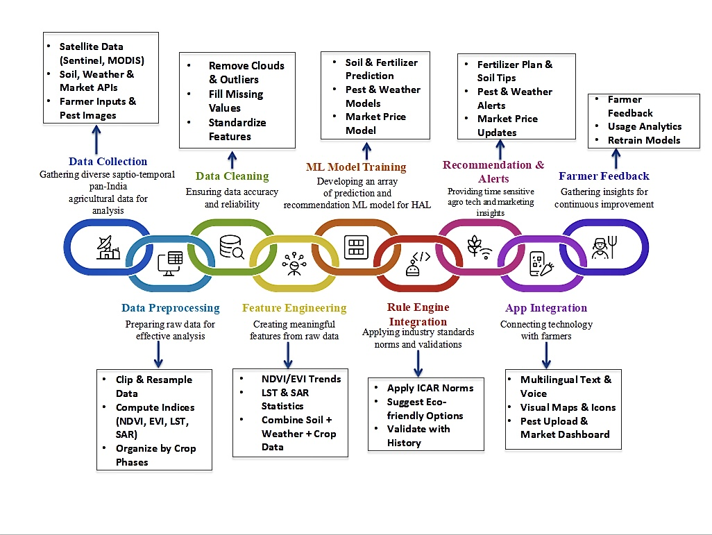
</div>

1. **Data Collection**: Gathering spatio-temporal pan-India datasets across Sentinel-2, MODIS, OpenWeather One Call 4.0, Mandi pricing APIs, and farmer inputs.
2. **Data Preprocessing**: Spatial clipping, coordinate resampling, and calculation of vegetation health indices (NDVI, EVI, LST, SAR).
3. **Data Cleaning**: Outlier detection, cloud mask filtering, and feature normalization.
4. **Feature Engineering**: Deriving temporal vegetative trends, surface temperature statistics, and multi-parameter soil-crop matrices.
5. **ML & AI Model Processing**: Predictive algorithms for crop health, disease detection from leaf images, and market price trend forecasting.
6. **Rule Engine & ICAR Integration**: Validation against Indian Council of Agricultural Research (ICAR) guidelines with organic-first treatment priority.
7. **Recommendation & Real-Time Alerts**: Tailored fertilizer plans, urgent weather notifications, pest alerts, and optimal selling date forecasts.
8. **App Integration & Voice**: Instant delivery via mobile app with voice interaction and multilingual text support.
9. **Farmer Feedback**: Capturing field observations to retrain and fine-tune models over time.

---

## 📱 Mobile Application Showcase

<div align="center">
<table>
  <tr>
    <td align="center" width="33%">
      <br/>
      <b>1. Welcome & Onboarding</b><br/>
      <i>Personalized Farmer Companion</i>
    </td>
    <td align="center" width="33%">
      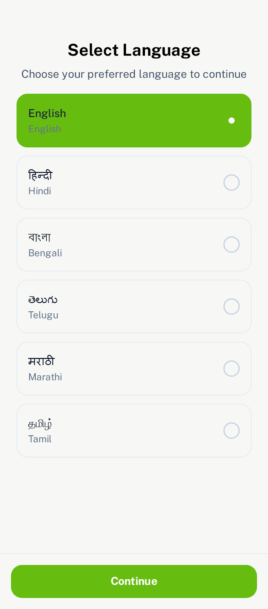<br/>
      <b>2. Multilingual Selection</b><br/>
      <i>Native Language Support</i>
    </td>
    <td align="center" width="33%">
      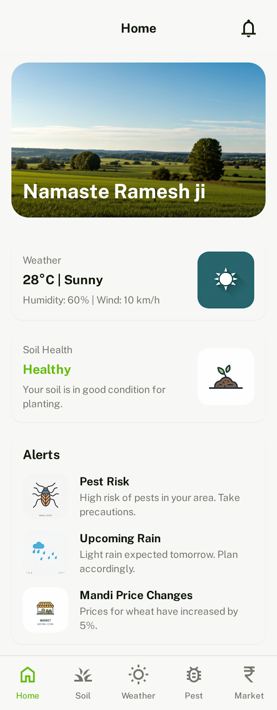<br/>
      <b>3. Home Dashboard</b><br/>
      <i>Real-Time Weather, Soil & Alerts</i>
    </td>
  </tr>
  <tr>
    <td align="center" width="33%">
      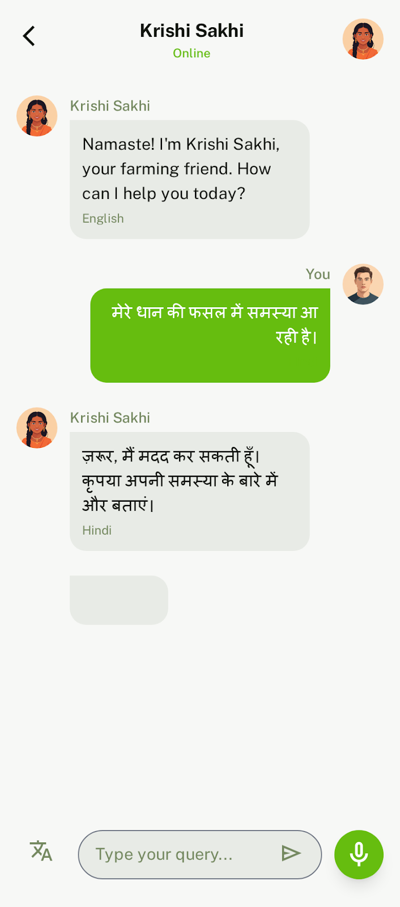<br/>
      <b>4. Krishi Sakhi (AI Voice)</b><br/>
      <i>Conversational Voice Q&A</i>
    </td>
    <td align="center" width="33%">
      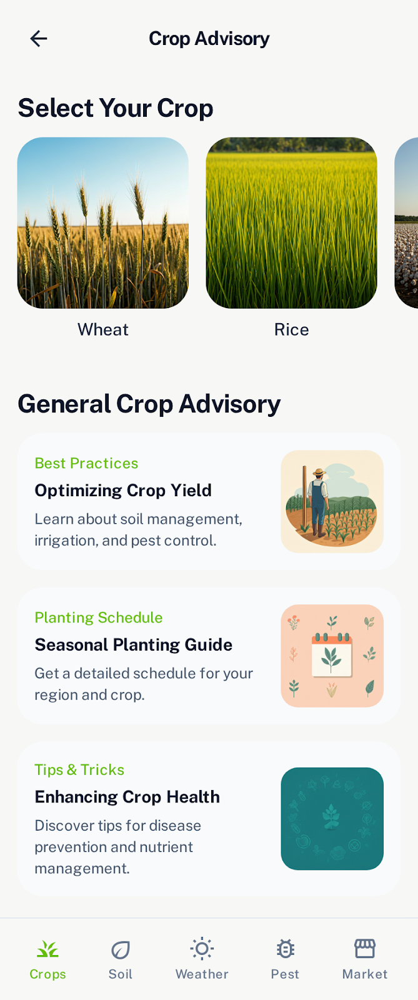<br/>
      <b>5. Crop Advisory</b><br/>
      <i>Stage-Wise Farming Advice</i>
    </td>
    <td align="center" width="33%">
      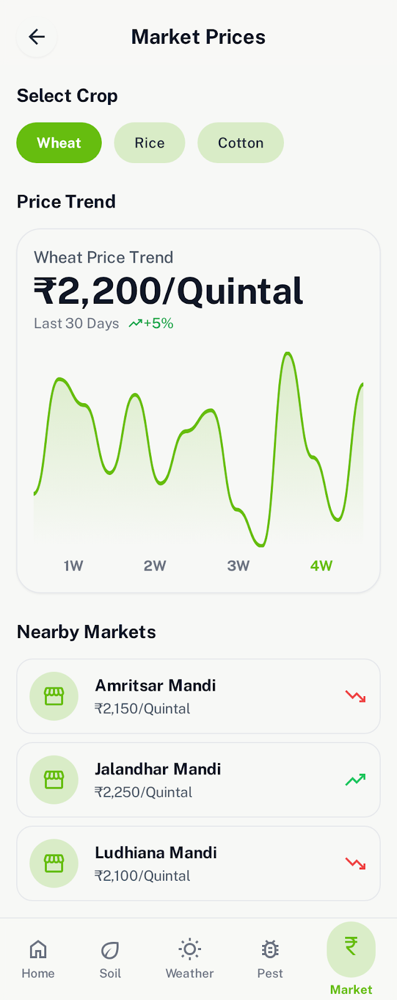<br/>
      <b>6. Mandi Market Prices</b><br/>
      <i>Live Price Tracking & Trends</i>
    </td>
  </tr>
</table>
</div>

---

## 🌍 Satellite Analytics & Ground Truth Stacking

<div align="center">
  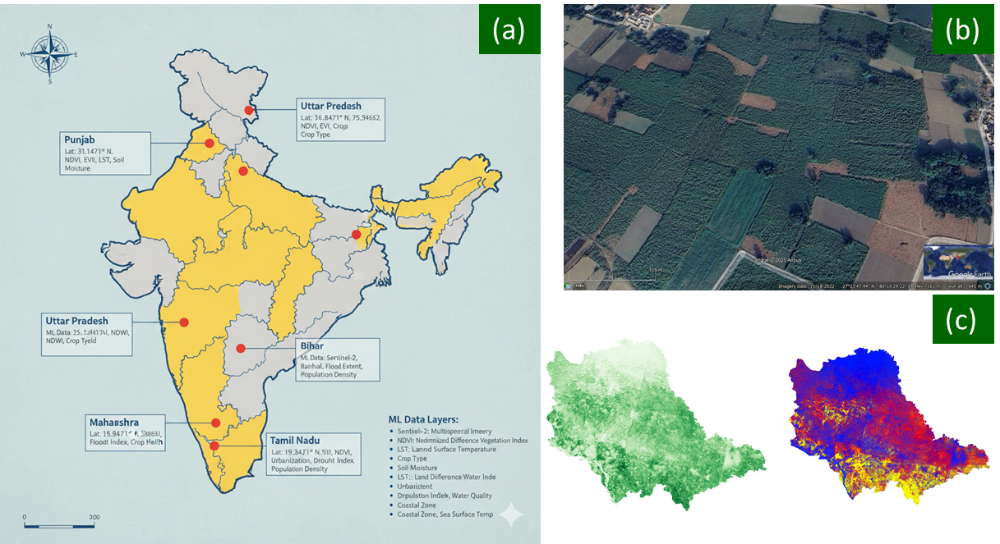
  <p><i>(a) Pan-India study area across diverse agro-climatic zones, (b) High-resolution ground truth imagery, and (c) Vegetation index stacking (NDVI / EVI) derived from Sentinel-2 multispectral bands.</i></p>
</div>

- **Sentinel-2 Multispectral Imagery**: Real-time 10-meter resolution tracking of crop vegetative vigor and canopy density.
- **Normalized Difference Vegetation Index (NDVI)**: Differentiates healthy standing crops from stressed or diseased patches.
- **Land Surface Temperature (LST) & Soil Moisture**: Detects drought onset and irrigation requirements before visible crop wilting occurs.

---

## 🌐 Government & Global API Ecosystem

<div align="center">
  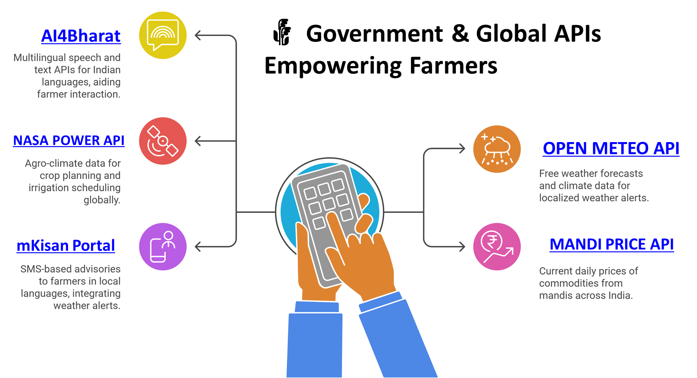
</div>

- **Soil Health Card (SHC) API & OCR**: Direct parsing of farmer test reports to calculate organic carbon, NPK ratios, and pH levels.
- **Mandi Price API (Data.gov.in)**: Live arrival quantities and modal prices across agricultural produce market committees (APMCs).
- **AI4Bharat / Bhashini**: Advanced Speech-to-Text and Text-to-Speech models built for Indian regional dialects.
- **OpenWeatherMap One Call 4.0 Timeline & NASA POWER**: Hyper-local precipitation forecasts, humidity, wind velocity, and solar radiation metrics.
- **mKisan Portal**: Integration with government agricultural extension schemes and SMS advisories.

---

## 💡 Feasibility, Viability & Measurable Impact

<div align="center">
<table>
  <tr>
    <td align="center" width="50%">
      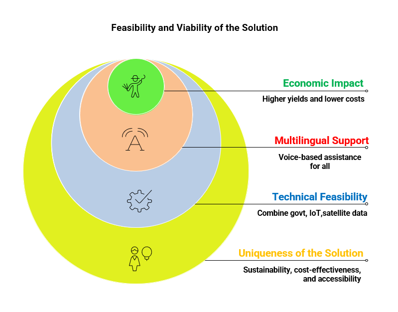
      <br/><b>Feasibility & Impact Framework</b>
    </td>
    <td align="center" width="50%">
      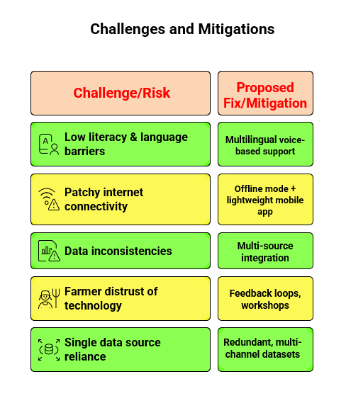
      <br/><b>Operational Challenges & Mitigations</b>
    </td>
  </tr>
</table>
</div>

### Expected Outcomes
- 📈 **20–30% Yield Boost**: Data-backed sowing dates, fertilization schedules, and proactive pest prevention (e.g., +4 quintals/acre for wheat).
- 💰 **15–20% Cost Reduction**: Eliminates chemical fertilizer over-application and targeted input purchases.
- 🌿 **30% Reduction in Fertilizer Runoff**: Protects groundwater quality and restores soil microbiome health.
- 👥 **Scalable to 1 Crore+ Farmers**: Built using lightweight serverless endpoints and low-bandwidth client optimization.

---

## 🛠️ Technology Stack

<div align="center">
  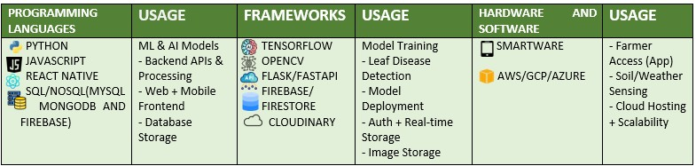
</div>

| Layer | Technologies |
| :--- | :--- |
| **Mobile & Web Frontend** | React Native, Expo SDK 57, Expo Router, React 19, Vanilla CSS styling, i18n localization |
| **Backend & APIs** | Node.js, Express.js (ES Modules), WebSockets (`ws`), REST APIs |
| **AI & NLP Engines** | Google Gemini 3.8 Flash, Hugging Face Inference Providers, Google Cloud Vision OCR |
| **Database & Auth** | Google Firebase Firestore (NoSQL), Firebase Authentication, Cloud Storage |
| **Media & Storage** | Cloudinary (Leaf image uploads & soil health card scans) |
| **Data Sources** | Sentinel Hub / Copernicus, OpenWeatherMap 4.0 Timeline, Data.gov.in Mandi API, NASA POWER |

---

## 📁 Repository Structure

```text
├── backend/                  # Node.js API server & background job worker
│   ├── src/
│   │   ├── server.js         # Express server, WebSocket endpoints & Gemini AI integration
│   │   └── worker.js         # Asynchronous satellite NDVI & job processing engine
│   ├── .env.example          # Template environment variable configuration
│   └── package.json
├── frontend/                 # React Native / Expo application
│   ├── app/                  # Expo file-based routing layouts
│   ├── assets/               # Application icons and graphic assets
│   ├── components/           # Reusable UI components
│   ├── screens/              # Core screens (Dashboard, DiseaseChat, MarketPrices, SoilHealth, etc.)
│   ├── services/             # API client, Gemini live socket, Google translate & i18n
│   ├── app.json              # Expo application configuration (SDK 57)
│   └── package.json
├── docs/                     # Project presentation & reference materials
│   ├── HAL_Project_Presentation.pptx    # Project Presentation Slide Deck
│   ├── HAL_Project_Summary.pdf          # Project Architecture & Overview Document
│   └── assets/                          # Architectural diagrams & UI screenshots
├── .gitignore                # Shields credentials, node_modules, and build outputs
└── README.md
```

---

## 🚀 Getting Started

### 1. Prerequisites
- **Node.js**: v18 or higher (tested on Node v22)
- **npm**: v9 or higher
- **Expo Go App**: Installed on your mobile phone (iOS / Android)

### 2. Backend Setup
```bash
# 1. Navigate to backend directory
cd backend

# 2. Install dependencies
npm install

# 3. Configure environment variables
# Copy .env.example to .env and fill in your API keys
cp .env.example .env

# 4. Add your Firebase serviceAccountKey.json to backend/ folder

# 5. Start the API server (runs on port 5050)
npm start
```

### 3. Frontend Setup
```bash
# 1. Open a new terminal and navigate to frontend directory
cd frontend

# 2. Install dependencies
npm install

# 3. Start Expo development server
npx expo start -c
```
- **Web**: Press `w` in the terminal to open in browser.
- **Mobile**: Scan the displayed QR code using the **Expo Go** app on your iPhone or Android device.

---

## 📚 References & Research Citations

1. L. Klerkx, *"Advisory services and transformation, plurality and disruption of agriculture and food systems: towards a new research agenda for agricultural education and extension studies,"* The Journal of Agricultural Education and Extension, vol. 26, no. 2, pp. 131–140, 2020.
2. K. G. Liakos et al., *"Machine Learning in Agriculture: A Review,"* Sensors, vol. 18, no. 8, Art. no. 8, 2018.
3. L. Klerkx and J. Jansen, *"Building knowledge systems for sustainable agriculture,"* International Journal of Agricultural Sustainability, vol. 8, no. 3, pp. 148–163, 2010.
4. M. Molina-Villa and L. Solaque, *"Machine vision system for weed detection using image filtering in vegetable crops,"* Rev. Fac. Ing. Univ. Antioquia, 2016.
5. C. Reid Turner et al., *"A conceptual basis for feature engineering,"* Journal of Systems and Software, vol. 49, no. 1, pp. 3–15, 1999.

### Project Documents
- 📊 **Presentation Deck**: [HAL_Project_Presentation.pptx](docs/HAL_Project_Presentation.pptx)
- 📄 **Project Architecture & Overview**: [HAL_Project_Summary.pdf](docs/HAL_Project_Summary.pdf)

---

<div align="center">
  <b>Built with ❤️ for Indian Agriculture</b><br/>
  <i>HAL — Harvest Advisory with Linguistic Intelligence</i>
</div>
